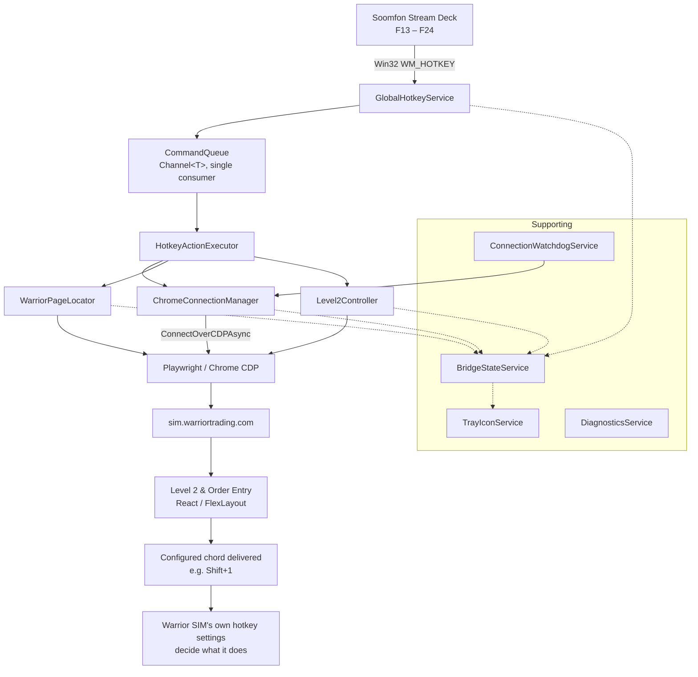

# Warrior Hotkey Bridge

[](LICENSE)

A resident Windows tray application that receives **global keyboard hotkeys** (from a Soomfon
Stream Deck, or any device that can send F13–F24) and routes them directly into the **Warrior
Trading SIM** web application running in Google Chrome — over the Chrome DevTools Protocol,
without stealing Windows focus and without AutoHotkey.

## Download and install

**[⬇ Download the latest installer](https://github.com/DragonAngel1st/WarriorHotkeyBridge/releases/latest)** —
`WarriorHotkeyBridge-Setup-x64.msi`, about 65 MB.

Double-click it. There is nothing else to install: the .NET runtime is included, so you do not
need .NET on the machine, and the bridge attaches to the Chrome you already have rather than
downloading a browser of its own. It installs for the current user only, so there is no
administrator prompt, and it starts itself when the install finishes — look for the tray icon
behind the **`^`** chevron next to the clock.

> **Windows will warn you that the publisher is unknown.** The installer is not code-signed,
> because a signing certificate is a paid annual subscription and this project is free. Choose
> **More info → Run anyway**. If you would rather not trust a binary from the internet — a
> perfectly reasonable position for something that can place trades — build it yourself with
> `pwsh -File installer/Build-Installer.ps1` and install the MSI that produces. Each release
> lists the SHA-256 of the file it shipped so you can verify what you downloaded.

Once installed, read [Configuring hotkeys](#10-configuring-hotkeys). A fresh install has **no
trading bindings** — only `F23` (Test) and `F24` (Diagnostics), neither of which sends a
keystroke. That is deliberate: an installer that shipped working buy and sell keys to a stranger's
machine would be reckless. The first run writes a commented template explaining the format.

---

> **Build status: all ten phases complete.** Hotkeys, Chrome/CDP, Level 2 targeting, command
> dispatch, recovery, diagnostics, start-with-Windows and the MSI installer are implemented and
> verified on a live SIM session. 160 unit tests; builds with warnings as errors.
>
> ⚠️ **If you currently run an AutoHotkey script for these keys, exit it.** Global hotkeys are
> exclusive — see [Troubleshooting](#13-troubleshooting).

---

## 1. Purpose

The Warrior SIM platform only processes its keyboard shortcuts when the **Level 2 & Order
Entry** FlexLayout panel is the selected component. Getting a Stream Deck key to reliably
reach that panel normally means faking OS-level input and window activation, which steals
focus from whatever you are actually doing.

This application takes a different route:

- Windows delivers the hotkey to us via `RegisterHotKey` — no keyboard hook, no AutoHotkey.
- We already hold a warm Chrome DevTools Protocol connection.
- We locate the Warrior page **by URL host**, select Level 2 **through the DOM**, and dispatch
  the keystroke **into the page**.

Chrome is never activated at the OS level, so you can be typing in VS Code or Notepad when you
press the key and your focus never moves.

## 2. Architecture



The bridge is a **transport, not a trading model**. It delivers a configured chord to the right
component; Warrior SIM decides what that chord means. See
[Configuring hotkeys](#10-configuring-hotkeys).

Two rules shape the whole design:

- **Fail closed.** A command is dispatched only if the target page's URI host is *exactly*
  `sim.warriortrading.com` (parsed and compared with `OrdinalIgnoreCase` — never
  `Contains("warrior")`), the title matches, and the Level 2 component is present.
  This is not theoretical: a normal Warrior setup also has `chatroom.warriortrading.com`
  open, which any substring test would wrongly accept.
- **Serialize commands.** All commands run through one queue with a single consumer, so two
  fast Stream Deck presses execute in a deterministic order and never race inside Playwright.

## 3. Requirements

| | |
|---|---|
| OS | Windows 11 (developed and tested on Windows 11 Pro) |
| Runtime | .NET 10 (`net10.0-windows`) — the shipped MSI will be self-contained |
| SDK (dev only) | .NET SDK 10.0.302 or later |
| Browser | Google Chrome, launched with remote debugging on a dedicated profile |
| Privileges | **None.** Runs `asInvoker`; never install as a service, never run elevated |

Running elevated would actively break things: an elevated process cannot reliably drive the
user's normally-launched Chrome.

## 3b. Installing

Run `WarriorHotkeyBridge-Setup-x64.msi`. It is a **per-user** install: no UAC prompt, no
administrator rights, nothing written outside your own profile.

| | |
|---|---|
| Installs to | `%LOCALAPPDATA%\Programs\WarriorHotkeyBridge\` |
| Start Menu | *Warrior Hotkey Bridge*, *…(Debug Console)*, *Stop Warrior Hotkey Bridge* |
| Stream Deck shortcuts | `%LOCALAPPDATA%\WarriorHotkeyBridge\Deck\` — *Go Trading*, *Stop Trading* |
| Size | ~65 MB download, ~212 MB installed |
| .NET required | **None** — the runtime is included |
| After installing | The bridge **starts automatically** — look for the tray icon |

On Windows 11 a newly-seen notification-area icon is hidden by default. If you do not see it,
click the **`^`** chevron next to the clock; drag it onto the taskbar to keep it visible.

**This installer never restarts your machine.** It sets `REBOOT=ReallySuppress`, because it
writes nothing outside your profile and touches no system file, so a restart could never be
legitimately required. If a file is genuinely locked the install fails visibly and you retry —
which for a tool used during market hours is by far the better failure.

Per-user is a requirement rather than a preference: global hotkeys are registered per
interactive session, configuration and logs live under `%LOCALAPPDATA%`, and start-with-Windows
uses `HKCU`. All of that is per-user state, so a machine-wide install would put the binaries
where a second user could run them while every setting they depend on stayed with the first.

Most of the install size is the Node runtime that Playwright's .NET client drives Chrome
through; it is not a bundled browser. The bridge always attaches to *your* Chrome.

### Upgrading

Install the new MSI over the old one — no need to uninstall first, and **you may leave the
bridge running**: the installer asks it to exit first and waits for it to release its files, so
there is no files-in-use prompt and no reboot.

An upgrade preserves everything under `%LOCALAPPDATA%\WarriorHotkeyBridge\`: your hotkey
mappings, logs, the Chrome profile you signed in with, and your start-with-Windows choice. Only
the program files are replaced. The bridge is restarted afterwards, so you are never left
mid-session with hotkeys that silently do nothing.

The previous version is removed **after** the new files are on disk, not before. Removing first
is the more obvious reading of "replace cleanly", but it puts the removal outside anything
rollback can undo: if the ~210 MB copy then fails partway — a full disk, a scanner holding a
freshly written DLL — MSI rolls back the new install and cannot resurrect the old one, leaving no
executable, no Add/Remove Programs entry to repair from, and a startup entry naming a file that
no longer exists. Installing first means the old product is still registered while anything can
still fail.

Reinstalling the **same** version works too, and replaces in place rather than adding a second
entry. That needs `AllowSameVersionUpgrades` on the `MajorUpgrade` element: without it the
upgrade range stops just short of the current version, an identical-version package is treated
as an unrelated product, and you end up with two Add/Remove Programs entries sharing one
directory. It also disarms the pre-install stop, since an unrecognised install sets neither
`Installed` nor `WIX_UPGRADE_DETECTED` — so the running bridge keeps holding its files and a
silent install reaches the files-in-use path. All three failures are one root cause.

If start-with-Windows is **off** when an update lands, the bridge asks once whether you want it
back on — because with it off, an updated bridge is not running and your hotkeys are dead until
you launch it yourself. Answer either way and it stamps the version, so it will not ask again
until the next update.

### Uninstalling

Settings → Apps, or `msiexec /x` with the product code. It removes the program files, the Start
Menu shortcuts and the start-with-Windows registration.

It deliberately **keeps** your configuration, logs and Chrome profile. Those live under
`%LOCALAPPDATA%\WarriorHotkeyBridge\`, the installer never created them, and silently deleting a
browser profile you signed into is not an uninstaller's decision to make. Delete that folder by
hand if you want it gone.

### Building the installer

```powershell
pwsh -File installer/Build-Installer.ps1
```

One command: clean self-contained publish, then WiX, producing
`artifacts/installer/WarriorHotkeyBridge-Setup-x64.msi`. The version comes from `VersionPrefix`
in `Directory.Build.props`, so the MSI, the executable and the tray "about" text cannot disagree.

**WiX is pinned to 5.0.2, deliberately.** WiX v6 and v7 require accepting the Open Source
Maintenance Fee EULA before they will build anything; v5 is plain MS-RL with no such gate, which
keeps this repository buildable by anyone who clones it. The `.wxs` uses the v4 schema namespace,
which v4, v5, v6 and v7 all share unchanged — so moving to v7 later needs no edit to the source,
only `wix eula accept wix7`.

Do not "downgrade" to v4 for the same reason: **4.0.0–4.0.4 carry three HIGH-severity CVEs**
([CVE-2024-24810](https://github.com/advisories/GHSA-7wh2-wxc7-9ph5),
[CVE-2024-29187](https://github.com/advisories/GHSA-rf39-3f98-xr7r),
[CVE-2024-29188](https://github.com/advisories/GHSA-jx4p-m4wm-vvjg)), fixed only in 4.0.5. A
NuGet audit against the GitHub Advisory Database reports 5.0.2 clean. Those CVEs would not reach
this product in any case — all three are in Burn (the `.exe` bootstrapper) or `RemoveFolderEx`,
neither of which this bare, per-user, non-elevated MSI uses, and WiX is a build-time tool whose
code never ships inside the package.

## 4. How the Chrome CDP connection works

Chrome exposes a DevTools endpoint on a loopback port. Playwright for .NET attaches to that
already-running browser with `Chromium.ConnectOverCDPAsync(...)` instead of launching its own.

```
WarriorHotkeyBridge ──HTTP/WebSocket──> 127.0.0.1:9222 ──> your existing Chrome ──> Warrior SIM tab
```

The connection is established **once** and kept warm. A hotkey press does not start a process,
initialize Playwright, or reconnect — it reuses the live connection, which is what keeps the
end-to-end path in the tens-of-milliseconds range.

The endpoint is bound to loopback deliberately: **the DevTools protocol is unauthenticated**,
and anything that can reach the port has full control of the browser. Never expose port 9222
on a routable interface.

## 5. Dedicated Chrome profile requirement

Modern Chrome refuses `--remote-debugging-port` when using the default user-data directory —
a security measure against exactly the kind of access described above. A separate profile is
therefore mandatory, not a preference.

This is also a safety boundary for you: the bridge never touches, kills or reconfigures your
ordinary Chrome profile. The dedicated profile lives at:

```
%LOCALAPPDATA%\WarriorHotkeyBridge\ChromeProfile\
```

You will sign in to Warrior Trading once in that profile; it keeps its own cookies and session.

## 6. Starting Chrome for development

```powershell
& "C:\Program Files\Google\Chrome\Application\chrome.exe" `
    --remote-debugging-port=9222 `
    --user-data-dir="$env:LOCALAPPDATA\WarriorHotkeyBridge\ChromeProfile" `
    https://sim.warriortrading.com
```

Verify the endpoint is live:

```powershell
(Invoke-RestMethod http://127.0.0.1:9222/json/version).Browser
```

Later the bridge can launch this itself (`Chrome:AutoLaunch`), but that is deliberately not
required for the core functionality to work.

## 7. Installing Playwright

*Arrives in Phase 3.* The bridge attaches to **your installed Chrome** over CDP — it does not
download or bundle Chromium. Only the Playwright .NET driver files are needed, and those ship
with the application; the packaged MSI will not require any post-install step.

## 8. Running in normal mode

```powershell
.\WarriorHotkeyBridge.exe
```

No console window. A tray icon appears within a second or so and shows current status:

| Icon | Status | Meaning |
|---|---|---|
| ⚪ Grey | `STARTING` / `WAITING FOR CHROME` | Alive, but not connected yet |
| 🟡 Yellow | `DEGRADED` | Chrome connected; Warrior page or Level 2 not ready |
| 🟢 Green | `READY` | Everything ready — a hotkey will execute |
| 🔴 Red | `ERROR` | A subsystem faulted; see the tray menu and log |

Right-click the icon for the full status breakdown plus the last command and its latency:

```
Warrior Hotkey Bridge 1.0.0
---------------------------
Status:       READY
Chrome:       Connected
Warrior SIM:  Found
Level 2:      Ready
Hotkeys:      Registered
Last:         Shift+Digit1 (Buy 1000 ASK...) [Succeeded 41ms]
---------------------------
Reconnect to Chrome
Run Diagnostics...
Open Log Folder
Copy Status to Clipboard
---------------------------
Exit
```

**Run Diagnostics** writes a timestamped report to
`%LOCALAPPDATA%\WarriorHotkeyBridge\Diagnostics\` and opens it. The same report is produced by
any hotkey bound to `"Action": "Diagnostics"`. It covers version and runtime, mode, the CDP
endpoint, browser/context/page counts, every candidate page with its pass/fail per check, what
each configured Level 2 selector matched, the FlexLayout selected state, every hotkey
registration with its failure reason, and the command queue depth.

It is safe to share: hosts and paths appear, **query strings never do** — on a real session
those carry the account `userId` and session `hash`. No cookies, tokens or page content.

Notifications only appear for a genuine error state, once per distinct fault. A successful
command never notifies. Double-clicking the icon opens the log folder.

## 9. Running in debug mode

```powershell
.\WarriorHotkeyBridge.exe --debug
```

Identical behaviour plus a live console at `Debug` level:

```
[14:32:04.412 INF] Warrior Hotkey Bridge 1.0.0 starting.
[14:32:04.432 INF] Mode: debug (console + verbose logging).
[14:32:04.575 INF] Tray icon created.
[14:32:04.579 DBG] State changed: STARTING (...) -> WAITING FOR CHROME (...)
[14:32:04.581 INF] Bridge running. State: WAITING FOR CHROME (...)
```

Run it from a terminal and the log appears in that terminal; launch it from a shortcut and it
gets its own window. (Technically: a PE image's subsystem is fixed at link time and .NET has
no supported runtime switch, so the single `WinExe` binary calls `AttachConsole` and falls
back to `AllocConsole`. See `Diagnostics/ConsoleHost.cs`.)

Other flags:

| Flag | Effect |
|---|---|
| `--debug`, `-d` | Console + `Debug` level logging |
| `--version` | Print version and exit |
| `--quit`, `--stop` | Ask a running instance to exit cleanly, wait for it, then exit |
| `--close-chrome` | With `--quit`, also close the dedicated Chrome instance |
| `--uninstall-cleanup` | Remove start-with-Windows registration and exit (used by the uninstaller) |
| `--silent`, `--quiet` | No console window and no dialogs; the exit code carries the result |
| `--help`, `-h`, `-?` | Print usage and exit |
| `--Section:Key=value` | Override any setting, e.g. `--Chrome:CdpEndpoint=http://127.0.0.1:9333` |

Nothing is hard-coded to port 9222: `Chrome:CdpEndpoint` is the single source of truth, and the
port the bridge *launches* Chrome on is derived from that same value, so the two can never
disagree. It is validated at startup as a real absolute `http`/`https` URL rather than merely
non-empty — a typo would otherwise pass validation and then launch Chrome on one port while the
bridge connected to another, which presents as "Chrome started but never connects".

**Only one instance runs at a time, in either mode.** Two would compete to register the same
global hotkeys, and the loser's keypresses would silently vanish. A second launch reports this
and exits with code `2`. Exit the running instance from the tray before starting another.

## 10. Configuring hotkeys

Edit the **user** configuration file — not the one next to the executable:

```
%LOCALAPPDATA%\WarriorHotkeyBridge\Configuration\appsettings.json
```

The first run writes this file for you, as a commented template explaining the format with
examples to copy. **Nothing in it is active**: the examples sit outside the `Bindings` object, so
the file as written changes no behaviour and no keystroke can be delivered until you deliberately
move one in. It is written once and never touched again — from the moment it exists it is yours,
and an application that edited a file holding live trading bindings would not be one worth
trusting.

That inertness is enforced by tests rather than by intention, because the file is created
automatically inside an application that can place trades: a future edit that made one of its
examples live would ship a working buy binding to everyone who installs the product.

It is layered on top of the shipped `appsettings.json`, which is what allows an MSI upgrade to
replace the defaults without ever discarding your mappings.

```json
{
  "Hotkeys": {
    "Bindings": {
      "F13": { "Action": "Test",  "Label": "Targeting pipeline test - sends nothing" },
      "F15": { "Send": "Shift+1", "Label": "Buy 75% BP" },
      "F16": { "Send": "Shift+2", "Label": "Sell half" }
    }
  }
}
```

Each binding sets **exactly one** of:

| Field | Meaning |
|---|---|
| `Send` | The keyboard shortcut to deliver into the Level 2 component, e.g. `"Shift+1"`. |
| `Action` | A built-in that sends nothing: `Test` or `Diagnostics`. Always safe to press. |

Optional on either: `Label` (free text for the log and tray) and `Level2Index` (which Level 2
panel to target when several are open; `0` = the first, and the default).

### The bridge does not know what your shortcuts do

This is the key design decision. `"Send": "Shift+1"` means *deliver Shift+1 to Level 2* —
nothing more. **What `Shift+1` does is defined in Warrior SIM's own hotkey settings**, where
you already maintain it. The bridge deliberately holds no notion of "buy", "sell" or
"cancel", because a second copy of those semantics could silently disagree with the first.
`Label` exists purely so *you* can read the log; the bridge never interprets it.

So the division of labour is:

| Concern | Owner |
|---|---|
| What `Shift+1` does | **Warrior SIM** hotkey settings |
| Getting `Shift+1` to Level 2 while your focus is elsewhere | **this bridge** |

Modifier names are normalised to Playwright's vocabulary, so `ctrl` → `Control` and
`win` → `Meta`; `Ctrl`, `Alt`, `Shift`, `Meta`/`Cmd`/`Win` are all accepted.

### `Shift+1` and `Shift+Digit1` are not the same thing

Measured against Chrome, because the obvious guess is wrong:

| You configure | `event.key` the page sees | `event.code` | Matches a real keyboard? |
|---|---|---|---|
| `Shift+1` | `1` | `Digit1` | **No** |
| `Shift+Digit1` | `!` | `Digit1` | **Yes** |

Playwright treats a bare character as *"produce exactly this character"*, but a named code as
*"press that physical key"*, which then goes through the keyboard layout. A real Shift+1
produces `!`, so **`Shift+Digit1` is the faithful spelling** and is what to use unless you know
the page reads `event.key`. A handler that reads `event.code` works with either.

The bridge warns at startup when a binding combines Shift with a bare digit, rather than
silently rewriting it — changing which character a trading shortcut delivers is not a decision
it should make for you.

### Keys that can and cannot be sent

`Send` values must be a single character or a browser key name (`Digit1`, `KeyA`, `F1`,
`Enter`, `Tab`, `Escape`, `ArrowUp`, `Space`, …), and names are **case sensitive**.

**Numpad keys are a trap.** Unshifted, they carry their navigation meaning exactly as a real
keyboard does with NumLock off — `Numpad1` arrives as `End`, `Numpad5` as `Clear`. Use `Digit1`
for a digit. The bridge warns if you configure one.

**F13–F24 cannot be sent into the page.** They exist as Windows virtual keys — which is exactly
what makes them good Stream Deck hotkeys — but have no browser key mapping. They work on the
left-hand side of a binding, never on the right. Invalid values are rejected at startup with an
explanation, not at the moment you press the key.

Configuration precedence (lowest to highest):

1. `appsettings.json` next to the executable (shipped defaults, treated as read-only)
2. `%LOCALAPPDATA%\WarriorHotkeyBridge\Configuration\appsettings.json` (yours)
3. Environment variables prefixed `WHB_` (e.g. `WHB_Chrome__CdpEndpoint`)
4. `--Section:Key=value` command-line arguments

## 10b. Running it as a trading session (Stream Deck)

The bridge is designed to be started and stopped by a deck button, so **F13–F24 only mean
"trade" while you are actually trading**. The rest of the time it is not running and not holding
those keys, leaving them free for anything else.

| Deck button | Runs | Effect |
|---|---|---|
| **Go trading** | `WarriorHotkeyBridge.exe --silent` | Starts the bridge; with `AutoLaunch` on it also brings up the dedicated Chrome and opens the login page. Point the same button at your trading deck page. |
| **Stop trading** | `WarriorHotkeyBridge.exe --quit --close-chrome` | Asks the running bridge to exit cleanly, **releases the hotkeys** and closes the dedicated Chrome. Point it back at your normal deck page. |

**Go is idempotent.** Pressed when a bridge is already resident it does not report an error and
does not start a second process — it hands the request to the running instance, which brings
Chrome back up if it has been closed. "Go" means *make the session ready*, whatever state things
are in, because that is what someone pressing a button on a deck actually wants. A button that
answered "an instance is already running" and did nothing would be technically accurate and
useless.

The installer creates both as shortcuts ready for a deck to launch. Point an **Open / Launch
application** action — not a Hotkey action — at:

```
%LOCALAPPDATA%\WarriorHotkeyBridge\Deck\Go Trading.lnk
%LOCALAPPDATA%\WarriorHotkeyBridge\Deck\Stop Trading.lnk
```

They pass `--silent`, so pressing an already-pressed button does nothing visible rather than
raising an "already running" dialog. Bind them **once**: the path is fixed and the installer
recreates them there on every upgrade, so deck bindings survive updates.

They live under the data folder rather than the install folder on purpose. The install folder is
replaced wholesale on upgrade, and deck software stores the path it was given — so a shortcut
that momentarily does not exist at the expected place is a button that silently stops working.

Do not bind Go or Stop to an F13–F24 key. Those are the keys the bridge itself claims; a deck
button that sends one would be swallowed by the bridge and routed to the SIM.

The Start Menu carries equivalents for when the deck is not to hand.

`--quit` is deliberately idempotent: it exits `0` whether or not anything was running, so a stop
button never reports an error for stopping something already stopped. It asks rather than kills,
so the log is flushed and an in-flight command is not abandoned half-way. It then **waits** for
the instance to release its single-instance mutex before returning, so "the button finished"
genuinely means "the hotkeys are free" rather than "the request was delivered". Exit code `3`
means it was still shutting down after 15 seconds.

`--close-chrome` only ever closes the instance the bridge is connected to. Verified by running
two throwaway Chromes on different debugging ports, connecting the bridge to one, and stopping
it: the connected instance closed and the other was untouched. Your ordinary Chrome is never a
candidate — it is not on the dedicated profile and not on the CDP port.

### Signing in

There is no credential storage in this application, by design. The bridge opens
`Chrome:StartUrl` (the member login page) in the dedicated profile and you sign in there, once
per session, exactly as you would normally.

That is a deliberate decision rather than an unfinished feature. Storing a broker-adjacent
password would make this small utility a credential store, with everything that implies, to save
a few seconds a day. Chrome's own password manager already does that job properly, and it works
in the dedicated profile — **saved passwords persist there even though the session does not.**

It also could not have been avoided by keeping the session alive: measured on a real account,
every Warrior authentication cookie (`ASP.NET_SessionId`, `memid`, `token`, …) is session-only.
The thirteen persistent cookies are analytics. The SIM URL additionally carries a per-session
`hash` minted during sign-in, so it cannot be navigated to directly from a cold start — which is
why `StartUrl` is the login page rather than the SIM.

To have one button do everything, enable auto-launch in your user configuration:

```json
{ "Chrome": { "AutoLaunch": true } }
```

The bridge then starts Chrome on the dedicated profile with remote debugging and opens
`Chrome:StartUrl` whenever the endpoint is not answering. It never touches your ordinary Chrome,
and launch attempts are rate-limited (`RelaunchCooldownSeconds`) so a misconfigured path cannot
spawn a process every few seconds.

### Why start/stop rather than "only while the SIM is open"

Tying registration to the SIM being open sounds equivalent but is not, because the signal
fluctuates for reasons that have nothing to do with your intent: a page reload destroys the
JavaScript context for a second or two, a layout rearrangement briefly removes the Level 2 node,
a busy renderer can push a probe past its timeout, and any reconnect drops every page
momentarily. Each of those would release and re-acquire the hotkeys.

That churn is worse than it sounds. `RegisterHotKey` is first-come and exclusive, so every gap
is a window in which another application can take F13 — and then the bridge cannot get it back
until that application exits. A two-second page reload could cost a trading key for the rest of
the day. During the gap a keypress also vanishes silently, or worse reaches whatever window has
focus instead.

A deck button carries your intent directly, so there is nothing to infer and nothing to debounce.

## 11. Configuring the Soomfon Stream Deck

Map each button to a **single F13–F24 key** with no modifiers.

Those keys exist in the Windows keyboard layout but are absent from physical keyboards, so
you will not collide with an application shortcut. If your Soomfon software cannot emit F13+,
use a modifier combination instead (e.g. `Ctrl+Alt+1`) and write that gesture in `Bindings`.

**Check which keys are actually free first.** Global hotkeys are exclusive per session, and
macro tools often claim a whole block of them. This probe reports availability without
changing anything:

```powershell
Add-Type @"
using System; using System.Runtime.InteropServices;
public class HK {
  [DllImport("user32.dll", SetLastError=true)] public static extern bool RegisterHotKey(IntPtr h,int id,uint m,uint vk);
  [DllImport("user32.dll", SetLastError=true)] public static extern bool UnregisterHotKey(IntPtr h,int id);
}
"@
$id = 1
foreach ($n in 13..24) {
  $vk = 0x7C + ($n - 13)
  if ([HK]::RegisterHotKey([IntPtr]::Zero, $id, 0x4000, $vk)) {
    [void][HK]::UnregisterHotKey([IntPtr]::Zero, $id); "F$n free"
  } else { "F$n TAKEN" }
  $id++
}
```

Run it with your Soomfon software and any macro tools running, so the result reflects reality.

## 12. Log file location

```
%LOCALAPPDATA%\WarriorHotkeyBridge\Logs\bridge-YYYYMMDD.log
```

Daily rolling files, 14 days retained, 32 MB per-file cap. `Information` and above in normal
mode; `Debug` and above under `--debug`. Writes are unbuffered so a crash cannot lose the
entries that explain it.

Logs never contain cookies, tokens, passwords or page content.

## 13. Troubleshooting

| Symptom | Cause and fix |
|---|---|
| **`Could not register F13: another application has already registered this key combination`** | **The single most likely cause is a running AutoHotkey script.** A global hotkey is exclusive to one process — the first claimant wins and everyone else gets Win32 error 1409. On this machine an AHK script was found holding **F13–F22**. Exit it (tray icon → Exit, or `Stop-Process -Name AutoHotkey64`) and restart the bridge. Also suspect Stream Deck/macro software, Logitech G HUB and similar. |
| Second launch does nothing but show a dialog | Expected — one instance only. Exit the running one from the tray first. |
| Tray is yellow and menu says `Hotkeys: Partially Registered` | Some keys registered, some were taken. The startup log names each one and why. |
| Dialog: *"Warrior Hotkey Bridge could not start"* naming a config file | Your `Configuration\appsettings.json` is malformed — usually a trailing comma or a missing brace. The dialog names the file; fix or delete it. Deleting it is always safe: it only holds overrides. Exit code is `1`. |
| Tray menu shows a `Last Error` about a hotkey, but all keys registered | A binding was dropped before registration — an unusable `Send` value, an unknown `Action`, an unparseable gesture, or a duplicate. The message says which. |
| A hotkey fires but the SIM does nothing | The chord reaches the page but Warrior does not recognise it. Check the shortcut in Warrior SIM's own hotkey settings first, then try the `Digit1` spelling (`Shift+Digit1`) in case the page reads `event.code`. |
| Tray icon stays grey | Chrome is not running with `--remote-debugging-port=9222` on the dedicated profile, or the port differs from `Chrome:CdpEndpoint`. |
| Tray icon is yellow | Chrome is connected but no page passes validation. Confirm a tab is open on `sim.warriortrading.com` and you are signed in. |
| `--debug` console appears empty | Check the file log; if it has content but the console does not, report it — the console rebinds stdout after attaching, which is the usual cause. |
| Hotkey does nothing | Another application already registered that key; `RegisterHotKey` fails for the second claimant. The startup log names each key that failed to register. |
| Nothing in the log folder | The process never started. Run `--debug` from a terminal to see the failure. |

## 14. File layout

```
Warrior Sim Hotkey Connector/
├── WarriorHotkeyBridge.sln
├── Directory.Build.props            # single authoritative version + quality gates
├── Directory.Packages.props         # central package versions
├── global.json                      # pinned SDK
├── src/WarriorHotkeyBridge/
│   ├── Program.cs                   # composition root, lifecycle, exception handlers
│   ├── app.manifest                 # asInvoker, DPI, long paths
│   ├── appsettings.json             # shipped defaults
│   ├── Configuration/               # ChromeOptions, WarriorSimOptions, HotkeyOptions, LogOptions
│   ├── Models/                      # HotkeyAction, BridgeState + subsystem state enums
│   ├── Startup/                     # AppPaths, CommandLineOptions, SingleInstanceGuard,
│   │                                #   ConfigurationSetup, TrayHostLifetime
│   ├── Diagnostics/                 # ConsoleHost (AllocConsole), LoggingSetup, BridgeLog, AppInfo
│   ├── Services/                    # BridgeStateService, WinFormsUiDispatcher
│   ├── Tray/                        # TrayApplicationContext, TrayIconService, TrayIconFactory
│   ├── Hotkeys/                     # NativeMethods, HotkeyWindow, HotkeyGesture,
│   │                                #   HotkeyBindingResolver, GlobalHotkeyService
│   ├── Chrome/                      # ChromeConnectionManager, ChromeLauncher, backoff
│   ├── Warrior/                     # page locator, Level 2 controller, window activator,
│   │                                #   HotkeyActionExecutor
│   └── Commands/                    # CommandQueue (Channel<T>), CommandDispatcher
├── tests/WarriorHotkeyBridge.Tests/ # gesture parsing, binding resolution, state, CLI, startup
├── installer/
│   ├── WarriorHotkeyBridge.wxs      # per-user MSI (WiX 5.0.2, v4 schema)
│   └── Build-Installer.ps1          # publish + wix, one command
├── tools/Send-FKey.ps1              # inject F13–F24 without a Stream Deck
└── artifacts/                       # build output: bin/, publish/, installer/
```

### What "Level 2 is selected" actually means

Measured on a live dashboard, because the DOM is less obvious than it looks.

The SIM page hosts **six separate FlexLayout instances** (`/c0`…`/c3`, plus a nested row).
Each has its own tabsets, and **each tabset marks its own front tab** with
`flexlayout__tab_button--selected` — eleven elements carried it at once on a real layout. That
class therefore proves only "front tab of my own group"; it says nothing about which component
receives the keyboard.

Exactly **one** element document-wide carries `flexlayout__tabset-selected`, on the tab bar of
the active tabset, and clicking a tab header moves it. That is the authoritative signal, and it
is what the bridge checks — both conditions must hold before a chord is dispatched.

The tab bar carrying it is **not** the tab button's parent. The real chain is:

```
flexlayout__tab_button ... widget-t-level2          <- the configured selector matches here
  flexlayout__tabset_tabbar_inner_tab_container
    flexlayout__tabset_tabbar_inner
      flexlayout__tabset_tabbar_outer               <- flexlayout__tabset-selected lives here
        flexlayout__tabset
```

Both intermediate elements match a loose "contains `flexlayout__tabset`" test while never
carrying the selected class, which is why `WarriorSim:TabsetTabBarClass` names the tab bar
explicitly rather than the code guessing at an ancestor.

After the click, focus lands on an order-entry `<input>` inside the panel — which is where a
dispatched chord needs to go.

### What the bridge recovers from

| Event | How it is detected | Recovery |
|---|---|---|
| SIM page reloads or navigates | `page.Url` no longer matches, or the readiness probe fails | Cache dropped, full rescan |
| SIM tab closed / reopened | `page.IsClosed`, and the page-count guard | Full rescan picks up the new tab |
| Layout rearranged, Level 2 moved | Probe re-runs the selectors every time | Re-resolved; locators are never cached |
| Chrome closed and restarted | `Browser.Disconnected` fires immediately | Reconnect with backoff (verified: 1.1s → 2.2s → 4.4s, then reconnected) |
| Chrome unreachable at startup | Connect fails | Retries to a 30s ceiling; the tray stays grey |
| **Zombie connection** | N consecutive health-check failures | Connection torn down and rebuilt |
| **Sleep / resume** | `SystemEvents.PowerModeChanged` | Connection dropped and rebuilt at once, hotkeys re-attempted |
| **Hotkey held by another app** | `RegisterHotKey` returns error 1409 | Re-attempted every 30s, so closing the other app reclaims it |

The zombie case is the non-obvious one: after a resume, or when something drops an idle socket,
`IsConnected` can still report `true` while nothing gets through. `EnsureConnectedAsync` trusts
that flag, so without an explicit liveness rule the bridge would believe it was connected
forever. Repeated health-check failures now force a rebuild — verified by suspending a Chrome
process, which leaves the socket open while nothing answers.

Health is judged on whether a probe **ran**, not on whether an exception escaped. Every
Playwright failure on that path is deliberately converted into an ordinary negative result so a
routine page reload cannot fault the watchdog and kill the tray — which means no exception ever
reaches the catch, and a counter driven from there would never fire at all. `Level2Result`
therefore carries an explicit `ProbeFailed` flag.

> Known limitation: the liveness signal comes from probing a page whose host matches. With
> Chrome open but no page on the SIM host at all, no probe runs, so a zombie connection would
> not be detected until a SIM page reappears. In that state the bridge already reports
> not-ready, so nothing would be dispatched regardless.

A contested hotkey cannot be taken — `RegisterHotKey` is exclusive and first-come, and the only
way around that is a low-level keyboard hook, which sees every keystroke in the session and is
deliberately avoided. Retrying is the honest alternative: close the application holding the key
and the bridge reclaims it within 30 seconds, no restart.

### Why the Level 2 probe is one script

The whole Level 2 inspection runs as a single `EvaluateAsync`, not a sequence of Playwright
locator calls. Two reasons, both measured on a live dashboard:

- **Latency.** Every locator call is a separate CDP round trip, and the command path probes
  Level 2 several times per press. A five-call probe became tens of round trips.
- **Correctness.** React re-renders the FlexLayout tree freely, so separate calls can describe
  different renders — a count from one, a class attribute from the next. One evaluation sees
  one consistent snapshot.

The script uses `textContent`, never `innerText`. `innerText` forces a synchronous layout
reflow, and the probe reads text from every tab button on the page; during market hours, with
live scanners repainting each second, that alone took a ~9 ms probe to ~180 ms.

Steady-state measured on a busy live SIM: **~9 ms** hotkey-to-complete when Level 2 is already
selected. The first press after startup is slower (~35 ms) while the JS context warms up.

### Choosing among several SIM pages

A normal Warrior session has more than one page on `sim.warriortrading.com` — the trading
dashboard plus popouts such as the scanner/alerts view (`?page=Alert&roomId=...`). They share
a host, a path and a title, so none of those can tell them apart.

The bridge therefore selects on **capability, not position**: a page is only a candidate if it
actually contains the Level 2 & Order Entry component. Scanner and alert popouts eliminate
themselves, and the choice survives tab reordering, window rearrangement and Chrome restarts —
none of which an index-based or title-based rule would.

Remaining ties are broken by tab visibility, then enumeration order. An ambiguous result is
reported in the tray, and the command path **refuses to dispatch** rather than guessing which
session gets the order.

The resolved page is cached and revalidated in one round trip, but the cache is bypassed the
moment any *other* open page shares the SIM host. That check costs nothing — `page.Url` is
tracked client-side — and it is what catches the two cases a tab count cannot: an existing tab
navigating onto the SIM, and a second SIM tab that was still loading during the last scan.
Either would otherwise leave a rival target invisible for as long as the cache lived.

> Query strings are never logged. On a real session they carry `hash` and `userId`, and
> diagnostics have to stay safe to paste into a support thread.

### Activating the SIM before dispatch

The bridge brings the SIM tab **and its Chrome window** to the front before sending a chord,
so you see the order go in. This is a deliberate reversal of the original "never steal focus"
goal, chosen by the operator.

Two mechanisms are needed, because measurement showed one is not enough:

| Step | Mechanism | Why |
|---|---|---|
| Make the SIM the active **tab** | CDP `Page.bringToFront` | Selects the tab within its window |
| Raise the Chrome **window** | Win32 `SetForegroundWindow` | Measured: CDP activation alone leaves the window behind other apps |

The measurement is worth recording, because the obvious assumption is wrong: activating a
target over CDP switches the tab but leaves the OS foreground untouched — a test on a real
session showed the foreground window unchanged (VS Code) before and after.

> Because Windows only grants foreground rights to a process that received the last input
> event, and the bridge receives the hotkey itself, it is entitled to raise the window. Popping
> Level 2 out into its own window changes which window is raised, not whether it works.

### If you pop Level 2 out into its own window

Nothing needs reconfiguring. The target is chosen by which page *contains* Level 2, so it
follows the panel automatically, and the main dashboard stops qualifying once the panel leaves.

One difference to be aware of: `.widget-t-level2` sits on a FlexLayout **tab button**, and a
popped-out window may have no tab bar at all. That case is treated as already selected rather
than as a failure — there is no tab to click. If the popped-out DOM turns out to need a
different selector, add it to `WarriorSim:Level2Selectors`; the list is tried in order.

### Threading model

| Thread | Owns |
|---|---|
| Main / UI (STA) | WinForms message loop, `NotifyIcon`, `WM_HOTKEY` receipt |
| Command consumer | Single reader over the command channel; all Playwright calls |
| Thread pool | Watchdog timer, reconnect/backoff |

`BridgeState` is an immutable record published through `BridgeStateService`; the tray marshals
back to the UI thread through `IUiDispatcher`. The UI thread is never blocked, and `.Result` /
`.Wait()` are never used on Playwright calls.

## Implementation phases

| Phase | Scope | Status |
|---|---|---|
| 1 | Project, configuration, logging, normal/debug mode, tray icon, single instance | ✅ Done |
| 2 | `RegisterHotKey` global hotkeys, gesture parsing, binding resolution, 68 unit tests | ✅ Done |
| 3 | Playwright/CDP connection, page enumeration, Warrior page identification, backoff | ✅ Done |
| 4 | Level 2 locator, selected-state detection, safe DOM selection, Level 2 page gate | ✅ Done |
| 5 | Command queue and single-consumer executor, latency instrumentation | ✅ Done |
| 6 | Tab + window activation, keyboard dispatch, key validation | ✅ Done |
| 7 | Watchdog, reconnection, sleep/resume recovery, hotkey reclaim | ✅ Done |
| 8 | Tray diagnostics, Run Diagnostics report, status polish | ✅ Done |
| 9 | Start with Windows, per-user, four-state detection | ✅ Done |
| 10 | Self-contained publish + per-user WiX MSI | ✅ Done |

## Building

```powershell
dotnet build                              # compiles with warnings-as-errors
dotnet test                               # 160 tests
pwsh -File installer/Build-Installer.ps1  # self-contained publish + MSI
```

Output lands under `artifacts/` (`bin/`, `publish/`, `installer/`).

## Start with Windows

**It registers itself the first time it runs**, so a fresh install starts with Windows without
you doing anything. Switch it off from the tray whenever you like — that choice is recorded and
never overridden, including by an upgrade.

### Why the application does this and not the installer

An MSI that installs a registry value *owns* it. If the installer wrote the Run key, then
switching startup off in the tray and later repairing or upgrading would silently put it back —
directly contradicting the requirement that an upgrade preserve user preferences. Letting the
application register itself once, and recording that it has, keeps a single owner and makes the
tray toggle authoritative.

The decision is stored in `%LOCALAPPDATA%\WarriorHotkeyBridge\State\startup.json`, which
survives upgrade and uninstall. Delete it to be asked again (that is, to be auto-enabled again
on the next launch).

If the preference says startup should be on but no registration is present, it is **restored**
on the next launch. That is not a new decision, it is the two halves of the same setting
disagreeing: the uninstaller removes the `Run` value while this preference lives under
`%LOCALAPPDATA%` and deliberately survives, so any uninstall-then-reinstall would otherwise lose
start-with-Windows silently — and you would find out the next morning when nothing responded.
A registration blocked in Task Manager is pointedly *not* restored, since rewriting the value
cannot clear that and doing so would override a decision made deliberately elsewhere.

The uninstaller removes the Run value by asking the *application* to do it
(`--uninstall-cleanup`), for the same single-owner reason — the MSI never declares that value as
a resource, so no repair or upgrade can resurrect a setting you switched off. The condition is
scoped to a real uninstall: during a major upgrade the old product is removed with
`UPGRADINGPRODUCTCODE` set, and clearing startup there would silently disable it for anyone who
had it on. Both halves are verified — an upgrade leaves the Run value and Task Manager's
approval record intact; an uninstall removes both.

One thing it *will* do unprompted: if you had startup on and an upgrade moved the executable,
the stale entry is repaired on the next launch. That honours the existing preference rather
than making a new decision — otherwise startup would appear enabled while launching a path that
no longer exists.

### Being asked again after an update

If startup is **off** and an update lands, the bridge asks once whether to switch it back on.
The reasoning: with startup off, an updated bridge is not running, so the hotkeys are dead until
you launch it by hand — and installing an update is a deliberate act, unlike the background
noise that would make repeated prompting obnoxious.

The version in effect when you answered is recorded alongside the choice, which is what bounds
this to once per update whichever way you answer. Two cases deliberately do not prompt:

- A preference written before this field existed carries no version, so it says nothing about
  which build you were refusing. The current version is adopted silently and the *next* update is
  the first that can honestly be called one.
- Startup blocked in Task Manager. Re-registering cannot override that, so offering to "re-enable"
  would promise something the answer could not deliver.

### The registry value

Toggling writes a single per-user value:

```
HKCU\Software\Microsoft\Windows\CurrentVersion\Run
    WarriorHotkeyBridge = "<path>\WarriorHotkeyBridge.exe"
```

Chosen over a Startup-folder shortcut (harder to toggle reliably from the app, easy to break),
over Task Scheduler (needs elevation for machine tasks, and adds a dependency for no benefit),
and over a Windows Service — a service runs in session 0 and could neither receive global
hotkeys, reach the user's Chrome, nor show a tray icon. No administrator rights are needed, and
nothing outside this user's profile is touched.

### Registered is not the same as will-run

Windows records Task Manager's **Startup apps** on/off switch separately, in
`...\Explorer\StartupApproved\Run`, as a binary blob whose first byte is `0x02` for enabled and
`0x03` for disabled. Switching an app off there leaves its Run value in place, so a naive check
would report "enabled" for something Windows will never launch.

The tray therefore distinguishes four states, all verified against a real registry:

| Menu shows | Meaning |
|---|---|
| Start with Windows ☑ | Registered and Windows will run it |
| Start with Windows ☐ | Not registered |
| *(blocked in Task Manager)* | Registered, but switched off under Startup apps — re-registering cannot override that, only you can |
| *(points at another copy)* | A leftover entry from a previous install location; clicking repairs it |

Disabling removes only this application's own value. The approval record belongs to Windows and
is never written to.

## Future improvements

- A settings UI for hotkey mapping instead of hand-edited JSON. Needs configuration reload
  (`reloadOnChange` is off today) plus hotkey re-registration on the UI thread, since Win32 binds
  a hotkey to the registering thread's window.
- An optional inactivity timer that stops the bridge automatically, releasing the hotkeys
  without a deck press.
- Dropping the Playwright dependency in favour of a direct CDP WebSocket client. It is the
  single largest thing in the install (~100 MB of Node runtime for a client we use a handful of
  methods from) and would remove a child process from the critical path.
- Per-command latency histograms surfaced in the diagnostics report.
- Authenticode signing of the executable and the MSI (build is designed to accept a signing
  step without restructuring).
- Optional support for chorded/modified gestures beyond plain F13–F24.
